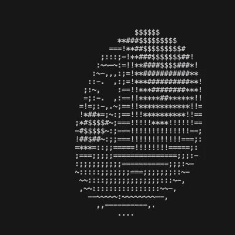

# Donut!



My first program in C. It is a very interesting exercise, and the math comes from this blog post: https://www.a1k0n.net/2011/07/20/donut-math.html

This code was reimplemented from the article's math, without looking at his code.

## Compile and run
This is only for MacOS and Linux. 
From the project directory, compile and run:

```
clang donut.c -o donut -lm
./donut
```

If you are using Linux and have gcc instead of clang:

```
gcc donut.c -o donut -lm
./donut
```
---
Enjoy your donut!